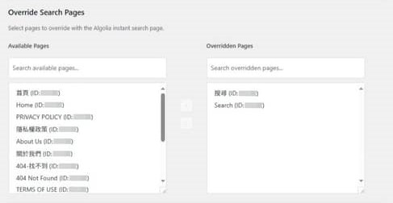

# Override Pages with Instantsearch

This feature allows you to override specific pages with the Algolia instantsearch page. This is useful for creating a dedicated search page on your site.

## Configuration

To configure this feature, go to the WP Algolia Search Addons settings page in your WordPress admin dashboard. You will find a section called "Override Search Pages".

In this section, you can select the pages that you want to override with the Algolia instantsearch page. You can search for pages and move them between the "Available Pages" and "Overridden Pages" lists.

## How it Works

When a user visits one of the overridden search pages, the plugin will load the Algolia instantsearch template instead of the default page template. The instantsearch template is determined by the settings of the WP Search with Algolia plugin.

The plugin will also enqueue the necessary CSS and JavaScript files from the WP Search with Algolia plugin to ensure that the instantsearch page is displayed correctly.
